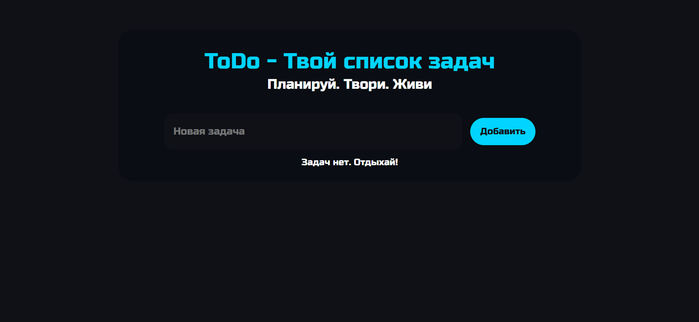

# ToDo App

Минималистичное приложение для управления задачами с тёмной темой, анимациями и сохранением данных в localStorage.



---

## Функционал

- Добавление задач
- Редактирование задач
- Удаление задач с анимацией
- Отметка выполненных задач
- Сортировка выполненных задач вниз списка
- Счётчик активных задач
- Динамические сообщения состояния
- Сохранение задач в `localStorage`
- Восстановление задач после перезагрузки страницы

---

## Технологии

- HTML5
- CSS3
  - Flexbox
  - Кастомные чекбоксы
  - Анимации
- Vanilla JavaScript
  - Event Delegation
  - Работа с DOM
  - LocalStorage API

---

## Запуск проекта

### Онлайн версия

GitHub Pages:

[Открыть приложение](https://davo-web.github.io/ToDo/)


---

### Локальный запуск

#### Клонирование репозитория

```bash
git clone https://github.com/Davo-web/ToDo.git
```

После этого откройте `index.html` в браузере.

---

## Планы по улучшению

- [ ] Очистка выполненных задач
- [ ] Переключение светлой / тёмной темы
- [ ] Фильтрация задач
- [ ] Категории и приоритеты
- [ ] Drag & Drop сортировка

---

## Автор

GitHub: [Davo-web](https://github.com/Davo-web)