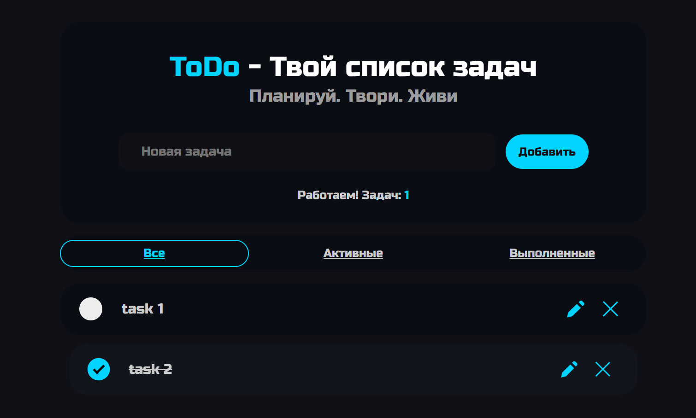

# ToDo App

Интерактивное ToDo-приложение с адаптивным интерфейсом, фильтрацией задач, анимациями и сохранением состояния через `localStorage`.

Проект написан на чистом JavaScript без использования фреймворков.



---

## Возможности

- Добавление задач
- Редактирование задач
- Удаление задач с анимацией
- Отметка выполненных задач
- Автоматическое перемещение выполненных задач вниз
- Фильтрация задач:
  - Все
  - Активные
  - Выполненные
- Динамические сообщения состояния
- Счётчик активных задач
- Сохранение данных в `localStorage`
- Восстановление состояния после перезагрузки
- Адаптивный интерфейс для мобильных устройств

---

## Технологии

### Frontend
- HTML5
- CSS3
  - Flexbox
  - Grid
  - Media Queries
  - CSS-анимации
  - Кастомные чекбоксы

### JavaScript
- Vanilla JavaScript
- Event Delegation
- Работа с DOM
- LocalStorage API
- Динамический рендеринг
- Фильтрация данных
- Управление UI-состоянием

---

## Архитектура

Проект построен вокруг массива объектов `taskArr`, который является единым источником состояния приложения.

Каждая задача хранит:
- уникальный `id`
- текст задачи
- состояние выполнения

Интерфейс полностью синхронизируется с состоянием массива и `localStorage`.

---

## Запуск проекта

### Онлайн версия

GitHub Pages:

[Открыть приложение](https://davo-web.github.io/ToDo/)

---

### Локальный запуск

Клонируйте репозиторий:

```bash
git clone https://github.com/Davo-web/ToDo.git
```

Перейдите в папку проекта и откройте `index.html`.

---

## Что было реализовано в процессе

- Адаптивная вёрстка
- Система фильтрации задач
- Редактирование без перерендера страницы
- Анимации удаления
- Делегирование событий
- Синхронизация UI и localStorage
- Работа с состоянием интерфейса

---

## Планы по улучшению

- [ ] Очистка выполненных задач
- [ ] Drag & Drop сортировка
- [ ] Категории и приоритеты
- [ ] Light / Dark theme toggle
- [ ] Сохранение порядка задач

---

## Автор

GitHub: [Davo-web](https://github.com/Davo-web)